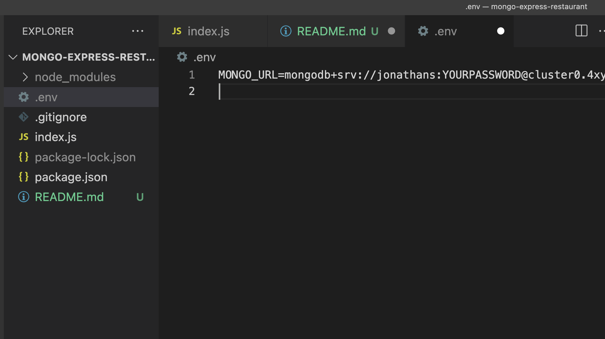
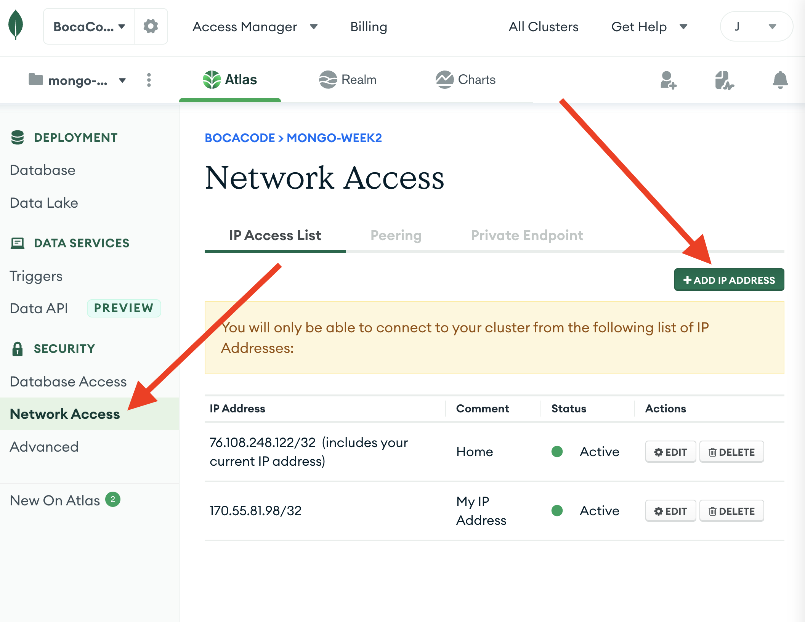

# NODE EXPRESS API WITH MONGO

### *NOTE:* You will need a `.env` file with the `MONGO_URL` with the connection link

-----

### Like this for example

----
Also if you are accessing your MONGO DB from different IP address you will need to add it to your Network Access in your Mongo Atlas

This API is doing full CRUD 
- Create with POST 
- Read with GET
- UPDATE with PATCH
- DELETE with DELETE
